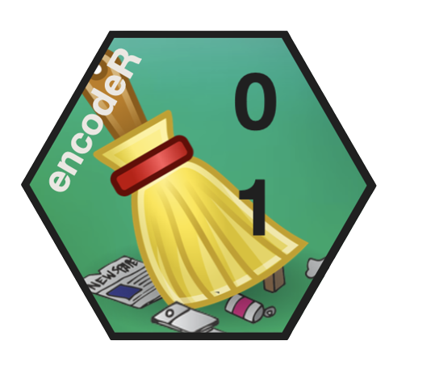
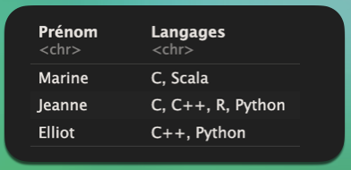
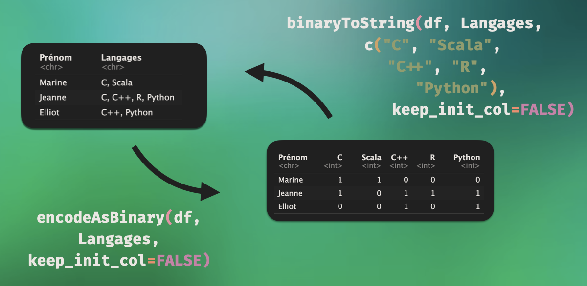

Juliette Chiapello
Last update : 2023-09-17

<!-- README.md is generated from README.Rmd. Please edit that file -->

# encodeR <a href="https://github.com/C-Juliette/encodeR"></a>

<!-- badges: start -->

[](https://github.com/C-Juliette/encodeR)
[](https://lifecycle.r-lib.org/articles/stages.html#experimental)
[](https://github.com/C-Juliette/encodeR/actions/workflows/R-CMD-check.yaml)
[](https://codecov.io/gh/C-Juliette/encodeR)
<!-- badges: end -->

Some data tables contain multiple pieces of data within a single entry.
This is the case in the table below, which lists multiple programming
languages per person, within a single entry.

<a href="https://github.com/C-Juliette/encodeR"></a>

The purpose of this package is to facilitate one-hot encoding for easy
conversion between the following two formats:

<a href="https://github.com/C-Juliette/encodeR"></a>

The package also allows for performing descriptive statistics, for
example, to find the most frequent combinations of inputs.

## Installation

You can install the development version of encodeR like so:

``` r
devtools::install_github("C-Juliette/encodeR")
```

## Example

This is a basic example which shows you how to solve a common problem:

``` r
library(encodeR)
## basic example code
```

What is special about using `README.Rmd` instead of just `README.md`?
You can include R chunks like so:

You’ll still need to render `README.Rmd` regularly, to keep `README.md`
up-to-date. `devtools::build_readme()` is handy for this.

You can also embed plots, for example:

In that case, don’t forget to commit and push the resulting figure
files, so they display on GitHub and CRAN.
